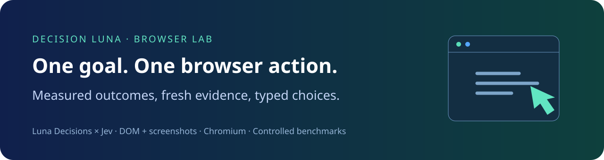
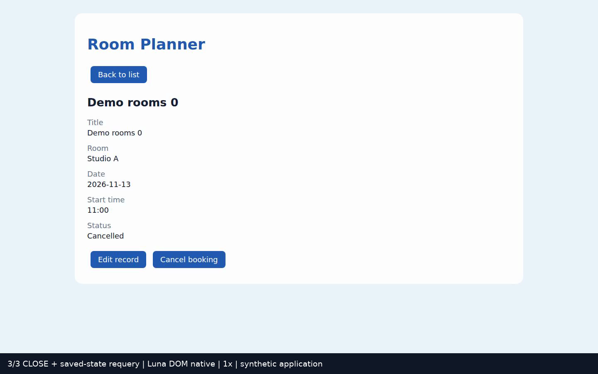
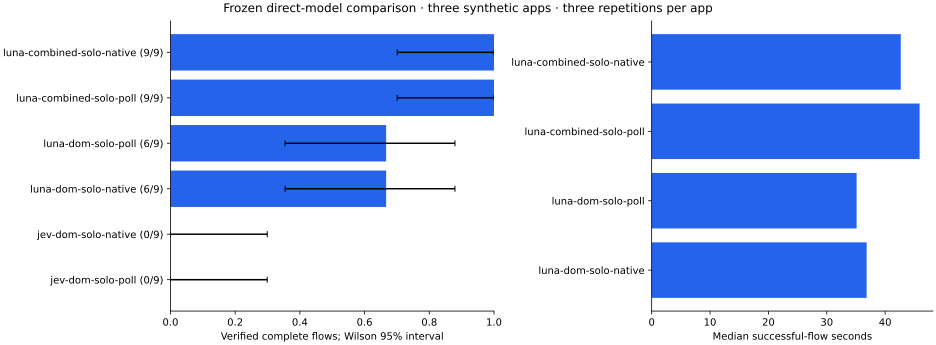
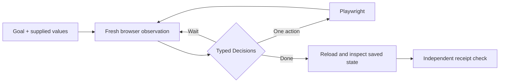

<p align="center"></p>

<p align="center"><a href="https://github.com/humanity-forever/decision-luna-browse-control/actions/workflows/ci.yml"></a>  </p>

# Can small decision models finish browser workflows?

A goal stays fixed. The browser supplies fresh evidence. **Luna Decisions or Jev chooses one action**, code executes it, and the loop observes again. This lab measures the result on three synthetic web applications: contact management, meeting-room reservations and support tickets.

The applications run in real Chromium and save state on a local server. Success requires **saving, changing, closing, and reopening** the requested record, plus an independent stored-state check. These controlled examples are a reproducible benchmark, not measurements of commercial websites.

[](assets/demo.mp4)

[Watch the complete 35-second synthetic room workflow at original speed](assets/demo.mp4) · [Recording provenance](assets/demo-provenance.json)

**Best measured direct-model setting:** Luna + DOM and screenshot + bounded native waits, **9/9 verified flows**, median **42.7 seconds**, median successful-flow API estimate **$0.00591**. The study has three repetitions per synthetic application; the 9/9 Wilson 95% interval is about 70%–100%. These measurements belong to frozen controller `a06ddd7`, with the disclosed isolated contact correction.

| Direct-model setting | Verified flows | Median successful time |
|---|---:|---:|
| Luna · DOM + screenshot · native waits | 9/9 | 42.7s |
| Luna · DOM + screenshot · model polling | 9/9 | 45.9s |
| Luna · DOM only · either waiting policy | 6/9 each | 35.1s / 36.8s |
| Jev · DOM only · either waiting policy | 0/9 each | — |

The separate helper follow-up completed **17/18 flows**; original `jev-browser` completed **3/3 support-ticket flows** and stopped on all contact/shadow-root and room/iframe flows. Its results are preserved as a system comparison. A shorter failed attempt is not a successful speedup.

The current release adds live control/subject checks before saving or closing, plus hidden-ancestor-frame exclusion. Those changes follow the frozen comparison. All 13 offline tests passed, and the revised source `4334258` verified **3/3 additional full workflows** (one per application), reported in a [separate release check](results/GUARDED_RELEASE_CHECK.md). The old 9/9 result is not attributed to the revised release.

[Measured results](results/RESULTS.md) · [Failure analysis](results/FAILURES.md) · [API roles](results/API_ROLES.md) · [Protocol](docs/PROTOCOL.md) · [Architecture](docs/ARCHITECTURE.md) · [Goals & Decisions](docs/GOALS_AND_DECISIONS.md) · [Reference systems](docs/BASELINES.md) · [Component experiments](results/COMPONENTS.md)



## What gets compared

| Factor | Conditions |
|---|---|
| Judgment model | `gpt-6-luna` Decisions / `jev-1.13.0` |
| Grounding | Current DOM / DOM + screenshot |
| Planning | No helper / `gpt-6.1-sol`, reasoning low |
| Waiting | Fresh model polling / bounded native waits + model judgment |
| Input planning | Every-step shortlist / independent field-plan reuse |

The primary study uses decision models directly with no helper. A separate one-block follow-up measures helper presence, field-plan reuse and combined-image assistance. Models share the observer, executor, tasks, limits and verifier. Original Jev systems are analyzed separately. Unsupported visual input is recorded explicitly; it is never silently converted with OCR or another model. Confidence values from different providers are not comparable.



Playwright handles visibility, enabled state and click actionability. Page load alone does not prove an application is usable. Optional settling waits for currently visible generic busy signals, with a 1.5-second limit, then retains model judgment. The polling target is one second; API latency extends it. Decisions requests never overlap. [OpenAI Decisions guide](https://developers.openai.com/api/docs/guides/decisions) · [Playwright actionability](https://playwright.dev/docs/actionability).

## Run it

Use Node 22+, Python 3 and FFmpeg. Tests and CI use local browser fixtures without paid calls.

```bash
npm ci
npx playwright install --with-deps chromium
npm test
npm run check
```

Store the two provider keys in a mode-0600 file under a mode-0700 directory, outside the repository. The default is `~/.config/decision-luna-browser-lab/credentials.json`:

```json
{"openai":"YOUR_OPENAI_KEY","typesafe":"YOUR_TYPESAFE_KEY"}
```

Run one small paid example first (its pilot outcomes stay separate):

```bash
npm run benchmark -- --paid --repeats 1 --apps contacts \
  --conditions luna-dom-guided-native --allowance 1
```

For a fresh complete study, use a separate runtime directory. The immutable manifest protects completed runs from accidental replay:

```bash
LUNA_RUNTIME=.runtime/study npm run benchmark -- --paid --repeats 3 --allowance 1
LUNA_RUNTIME=.runtime/study npm run report
```

`LUNA_CREDENTIALS` selects an existing private credential file. `LUNA_LEDGER` lets several experiments share one persistent provider ledger. Unknown-response costs remain reserved; helper calls and failed attempts count. Each provider defaults to an independent $100 maximum. Explicitly approved limits can be set in the ledger sidecar `<ledger>.limits.json`, without changing the other provider, while each study also enforces its smaller allowance. Amounts are conservative token-rate estimates, not verified invoices.

## Examples you can inspect

- **Contact Studio:** create a contact, change the phone number, archive it, and reopen the retained record. Controls live in an open shadow root.
- **Room Planner:** create a reservation, change its date and time, cancel it, and reopen it. Native date/time controls live in an iframe.
- **Support Desk:** create a ticket with Normal priority, change it to Urgent, resolve it, and inspect saved status.

Every repetition uses an independent server state. Closed records require an explicit all-records view. The agent receives goals and supplied values, without fixture receipts, internal server responses or scripted navigation paths. The verifier can inspect stored state separately.

## Mechanism and original-system studies

`experiments/architecture-study.mjs` measures bounded waits, model readiness, supplied-value choices, helper cadence and stale-state rejection on small local fixtures. Its receipts are checked independently. `experiments/native-jev.mjs` runs the pinned standalone library as a separate complete-system baseline, with all typing calls metered. A Computer Use bridge is marked unavailable when its required runtime is absent. Read [third-party notices](THIRD_PARTY_NOTICES.md) before reusing the DOM-settle arm.

## Reading the evidence

Results preserve successful, failed, blocked, unsupported and downstream-not-started outcomes. Pilot amendments are separate from frozen comparisons. We report complete workflow success, Wilson intervals, time, cost, API roles, waits, actions and plan-cache reuse. Small samples and known synthetic application layouts limit generalization.

Recordings contain only synthetic local applications. Demo edits disclose omitted navigation and speed changes. Raw traces and credentials are ignored by Git. Contributions should include a reproducible local example and sanitized evidence. [Contributing](CONTRIBUTING.md) · [MIT license](LICENSE).
